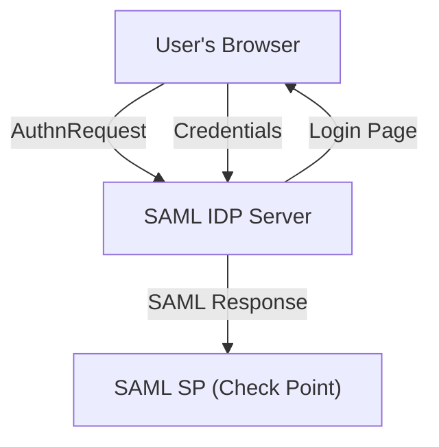

# SAML IDP Simulator for Check Point

[](https://www.python.org/)  [](https://en.wikipedia.org/wiki/SAML_2.0)  [](LICENSE)

---

## 🚀 Overview

**SAML IDP Simulator SMS** is a professional Identity Provider (IdP) simulator designed for **integration, demonstration, and testing** with enterprise SAML 2.0 Service Providers, including **Check Point Harmony**, **Quantum**, **CloudGuard**, and SASE products. This draft works with SmartCnsole authentication. More to be added.

This simulator helps you:
- Mimic a real-world SAML Identity Provider  
- Test and demonstrate SAML authentication, assertion attributes, and signature flows  
- Integrate seamlessly with Check Point security products for workshops, demos, and PoCs  

---

 

---

## 🌟 Key Features

- 🔒 **Full SAML 2.0 Protocol Support**: AuthnRequest, SP-initiated SSO, signed Assertions & Responses  
- 📝 **Custom Attribute Mapping**: Send any attribute, group, username, or custom fields  
- 🔑 **Dual Signature**: Signs both `<Response>` and `<Assertion>` with X.509 certificates  
- 📄 **Web-based User Login Flow**: HTML-based login, error handling, and session management  
- 🛠️ **Group Simulation**: Mimic user groups, or multi-attribute scenarios  
- ⚡ **Compatible with Check Point and other SAML SPs**  

---

## 🏗️ Architecture Diagram


---

## ⚙️ How It Works

1. **SP-initiated SSO**: Check Point (or any SP) sends an AuthnRequest to the `/sso` endpoint.  
2. **IdP handles request**: The simulator decodes, validates, and extracts the SP entity ID, ACS URL, and RelayState.  
3. **User Authentication**: User logs in via the simulator’s web login page.  
4. **SAML Response Generation**:  
   - Builds and signs the `<Assertion>`  
   - Builds and signs the `<Response>` (including the Assertion)  
   - Both signatures embed the X.509 certificate  
   - All fields (Issuer, InResponseTo, Audience, Recipient, etc.) match SP’s expectations  
5. **Form POST**: The browser auto-submits the signed SAML response (and RelayState) to the SP’s ACS URL.  
6. **SP Validation**: Check Point validates signatures, extracts attributes, and completes the login.  

---

## 🔐 Supported Flows & Bindings

- **SAML 2.0 SP-initiated SSO** (`urn:oasis:names:tc:SAML:2.0:protocol`)  
- **HTTP-POST Binding** for both AuthnRequest and Response  
- **Dual-Signature** (Response + Assertion)  
- **Customizable** assertion attributes, including username, email, groups  

---

## 💻 Integration Example: Check Point

### Prerequisites
- Check Point Quantum Management. Will add support for / Harmony / CloudGuard configured for SAML  
- Simulator’s public signing certificate imported as the IdP certificate in Check Point. We can import the metadata file.

### Steps

1. **Configure Check Point**  
   - **Entity ID**: Generated in the Idneity Provider Object in SmartConsole 
   - **Reply URL / ACS URL**: Generated in the Idneity Provider Object in SmartConsole (e.g. `https://<sp-host>/cpmws/saml/acs/sso`)  

2. **Configure the Simulator**  
   - Add Check Point SP’s Entity ID and ACS URL to `trusted_sp` in config  (.venv) or from the IDP portal (/admin/idp-config)
   - Ensure `CERT_PATH` and `KEY_PATH` point to your .pem files  

3. **Test the Flow**  
   - Initiate login from Check Point portal  
   - Authenticate as a user in the simulator UI  
   - Confirm successful SSO in Check Point  
   - Note: Make sure the administrator exists in SmartConsole

---

## 📝 Requirements

- **Python** 3.8+  
- **Flask**  
- **lxml**  
- **signxml**  
- **flask-wtf**, **flask-limiter**  
- (All other dependencies in `requirements.txt`)  

---

## ⚙️ Installation

```bash
# Clone the repo
git clone https://github.com/alshawwaf/SAML-IDP-Simulator.git
cd saml-idp-simulator

# Install dependencies
pip install -r requirements.txt

# [Optional] Build & run with Docker
docker build -t saml-idp-simulator .
docker run -p 5000:5000 \
  -e CERT_PATH=/app/certs/idp-cert.pem \
  -e KEY_PATH=/app/certs/idp-key.pem \
  saml-idp-simulator
```

---

## 🔧 Configuration

1. **Variables**  
   
   Create a `.venv` file and update it with your environment values:
```bash
ADMIN_USERNAME="admin"
ADMIN_PASSWORD="Vpn123!" # for the admin used in /admin/idp-config administation tasks (super admin for the DIP)
SECRET_KEY="Super-very-secret-key"
IDP_HOST="localhost"
IDP_PORT="5000"
DEFAULT_SP_ENTITY_ID="https://XXX.local/cpmws/saml/acs/id/XXX" 
DEFAULT_SP_ACS_URL="https://IP/cpmws/saml/acs/sso"
SSO_SERVICE_URL="https://localhost:5000/sso"
FLASK_DEBUG=1
APP_BASE_PATH=.
```

2. **Environment Variables**  
   - `SAML_ENDPOINT`: e.g. `https://localhost:5000/sso`  
   - `CERT_PATH`, `KEY_PATH`: paths to your cert and private key  
   - `IDP_HOST`, `IDP_PORT`: for Docker and entrypoint scripts  

3. **Admin UI** (if available)  
   - Navigate to `/admin/idp-config` to add or update SP entries  

---

## ▶️ Running the Simulator

```bash
# Directly with Python
python -m venv .venv
python -m pip install -r requirements.txt
python run.py

# Or with Flask CLI
export FLASK_APP=run.py
flask run --cert=certs/idp-cert.pem --key=certs/idp-key.pem

# Or via Docker
docker run -p 5000:5000 \
  -e CERT_PATH=/app/certs/idp-cert.pem \
  -e KEY_PATH=/app/certs/idp-key.pem \
  saml-idp-simulator
```

Access the UI at:  
```
https://localhost:5000/
```

---

## 👤 User Guide

- **GET /sso** – IdP endpoint for AuthnRequests  
- **GET /login** – Login form for SAML users  
- **POST /login** – Handle login, generate & send SAMLResponse  
- **GET /logout** – End SAML session  
- **GET /metadata** – Download SAML metadata XML  
- **GET /download-cert** – Download IdP public certificate  

---

