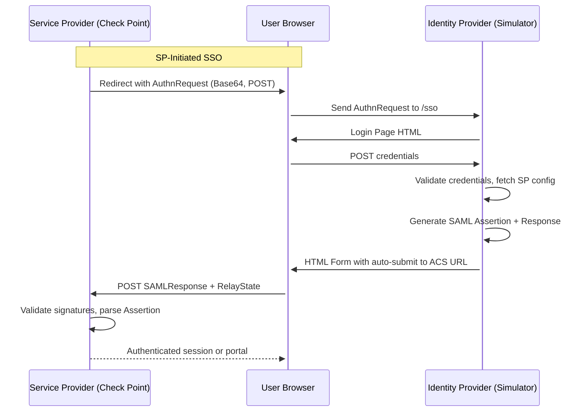

# 🛡️ Identity Simulator for Check Point

[](https://www.python.org/)
[](https://en.wikipedia.org/wiki/SAML_2.0)
[](https://datatracker.ietf.org/doc/html/rfc7644)
[](LICENSE)

---

## 🚀 Overview

The **Identity Simulator** (formerly SAML IDP Simulator) is a modern Identity Provider emulator tailored for **Check Point environments** (Quantum, CloudGuard, and Check Point SASE — formerly Check Point SASE). It provides a **production-grade SAML SSO experience** plus an optional **SCIM 2.0 provisioning surface** for:

- Security PoCs
- Workshops and demos
- Integration testing — including **Check Point SASE SCIM provisioning**

✨ Featuring a full-featured **web admin portal**, **dynamic attribute mapping**, **realistic SAML flows**, and **bidirectional SCIM** (acts as both a SCIM server *and* a client that pushes to upstream SCIM endpoints like Check Point SASE).

---


---

## 🌟 Key Features

### SAML 2.0
- 🔐 **SP-Initiated SSO** using signed SAML Response + Assertion
- 🧩 **Dynamic Attribute Mapping** via admin UI (claim → user field)
- 👤 **User Management** with modal-based edit/create/delete
- 🧪 **Multi-SP Support** with isolated configuration per SP
- 🔑 **X.509 Dual Signature** support
- 🕸️ **Web Login Flow** simulates realistic browser-based authentication
- 📁 **One-click Metadata / Certificate Download**
- ⚙️ **Admin Portal** for easy control and visibility

### SCIM 2.0 (optional, off by default)
- 🔁 **Bidirectional** — acts as SCIM server (receives pushes from Entra / Okta) *and* SCIM client (pushes to Check Point SASE)
- ⚡ **Zero-touch enablement** — set `ENABLE_SCIM=true`; encryption key + first bearer token auto-generated
- 🌍 **One-click Check Point SASE region presets** (US / EU / AU / IN)
- 📜 **Full push audit log** with request/response bodies — perfect for live demos
- 🔄 **Optional auto-sync** of admin user CRUD to every enabled SCIM target
- ✅ **48/59** `scim2-tester` RFC compliance checks pass

---

## 🧱 Architecture (SAML Flow)



---

## 💡 Typical Use Case

1. Configure your Check Point and add a new Identity Provider Object
2. Trigger login from SmartConsole / Portal
3. The simulator receives and parses the AuthnRequest
4. User logs in via the web interface
5. A signed SAML Response + Assertion is generated and POSTed back
6. Check Point logs the user in ✅

---

## 🛠️ Setup Instructions

### 🔧 Requirements

- Python 3.8+
- Flask
- signxml, lxml, flask-wtf, flask-limiter
- All dependencies: `pip install -r requirements.txt`

### 📦 Install & Run

```bash
# Clone the repo
git clone https://github.com/alshawwaf/SAML_IDP_Simulator.git
cd SAML_IDP_Simulator

# Install dependencies
python -m venv .venv
source .venv/bin/activate
pip install -r requirements.txt

# Run
python run.py
```

### 🐳 Optional: Run with Docker

```bash
docker build -t saml-idp-simulator .
docker run -p 5000:5000 \
  -e CERT_PATH=/app/certs/idp-cert.pem \
  -e KEY_PATH=/app/certs/idp-key.pem \
  saml-idp-simulator
```

### 🔄 SSL Toggle

Set `ENABLE_SSL=false` to run without HTTPS (useful behind a reverse proxy):

```bash
docker run -p 5000:5000 -e ENABLE_SSL=false saml-idp-simulator
```

---

## ⚙️ Configuration

### .env File

```bash
ADMIN_USERNAME="admin@cpdemo.ca"
ADMIN_PASSWORD="Cpwins!1@2026"
SECRET_KEY="Super-very-secret-key"
IDP_HOST="localhost"
IDP_PORT="5000"
DEFAULT_SP_ENTITY_ID="https://your-sp.example.com/acs/id/..."
DEFAULT_SP_ACS_URL="https://your-sp.example.com/acs/sso"
SSO_SERVICE_URL="https://localhost:5000/sso"
FLASK_DEBUG=1
```

---

## 🔐 Admin Portal

> 🧭 Navigate to `https://localhost:5000/admin`

**Default Credentials:**
- Username: `admin@cpdemo.ca`
- Password: `Cpwins!1@2026`

### 🔹 SP Management

- Add/edit SPs with:
  - Name, Entity ID, ACS URL
  - Claim-to-user-field mapping
- Configure multiple SPs independently

### 🔹 User Management

- Add/edit/delete users
- Auto-populated field mappings
- Password hashing included

---

## 🔄 Endpoints

### SAML
| Endpoint           | Description                      |
|--------------------|----------------------------------|
| `/sso`             | Handles incoming AuthnRequest    |
| `/login`           | Login form                       |
| `/logout`          | Logs the user out                |
| `/metadata`        | SAML metadata XML                |
| `/download-cert`   | Public certificate download      |
| `/admin`           | Admin UI                         |

### SCIM 2.0 (only when `ENABLE_SCIM=true`)
| Endpoint                          | Description                                  |
|-----------------------------------|----------------------------------------------|
| `/scim/v2/ServiceProviderConfig`  | RFC 7644 §5 capability advertisement         |
| `/scim/v2/ResourceTypes`          | User + Group resource types                  |
| `/scim/v2/Schemas`                | Schema definitions                           |
| `/scim/v2/Users` (+ `/<id>`)      | GET/POST/PUT/PATCH/DELETE, bearer auth       |
| `/scim/v2/Groups` (+ `/<id>`)     | Same — full CRUD                             |
| `/scim/v2/.search`                | POST search across User + Group              |
| `/admin/scim/`                    | Admin UI: targets, tokens, push log          |

---

## 🧪 Check Point Integration Steps

1. **In SmartConsole**:
   - Create an Identity Provider object
   - Set ACS URL and Entity ID
   - Upload metadata or public certificate

2. **In the Simulator**:
   - Add SP config via admin UI
   - Ensure ACS/Entity ID matches
   - Start login from SmartConsole → simulate SSO

✅ Ensure the user exists in both systems.

---

## 🔁 SCIM 2.0 (optional)

The simulator can also speak SCIM 2.0. It's **bidirectional**:

| Direction | Mode | Used when |
|---|---|---|
| **Inbound** | SCIM **server** at `/scim/v2/*` | An external IdP (Entra ID, Okta, JumpCloud) pushes users *into* the simulator |
| **Outbound** | SCIM **client** that pushes to a remote SCIM server | The simulator pushes users *to* Check Point Check Point SASE (or any RFC 7644 server) |

You can use one direction, the other, or both — the same `ENABLE_SCIM=true` flag turns on the whole surface.

When `ENABLE_SCIM=false` (the default), the SAML flow runs exactly as before — no new tables created, no new routes registered.

---

### ⚡ Quick start

**1. Enable SCIM** — add **one variable** to `.env` or your Dokploy environment:

```bash
ENABLE_SCIM=true
```

**2. Redeploy.** That's it for the inbound direction. On first boot the simulator automatically:

- Derives the token-encryption key from `SECRET_KEY` (no manual key generation needed)
- Auto-generates one default inbound bearer token
- Prints it in the startup log AND saves it to `data/.scim-bootstrap-token`
- Surfaces it in a banner on `/admin/scim/` with a one-click "I copied it" button

You'll see this in the container logs at startup:

```
======================================================================
SCIM default inbound bearer token (auto-generated)
  Token: ZIoW4d1p6cKH8ytP26fEQf-Q_X5H8aLqajrx5OwXtFM
  Bootstrap file: /app/data/.scim-bootstrap-token
  Use as: Authorization: Bearer <token>
  Manage at /admin/scim/inbound-tokens
======================================================================
SCIM encryption key auto-derived from SECRET_KEY (override with SCIM_ENCRYPTION_KEY env var)
SCIM endpoints enabled at /scim/v2 (server) and /admin/scim (admin UI)
```

Three ways to read the token:
- **Dokploy / `docker logs`** (printed at startup)
- **File**: `cat /app/data/.scim-bootstrap-token` (chmod 600, persisted in the `saml_idp_data` volume)
- **Admin UI**: the SCIM dashboard banner the first time you open it

Paste this token into your IdP's "Secret Token" / "API Token" field, point its SCIM tenant URL at `https://<your-host>/scim/v2`, and pushes work.

---

### 📤 Outbound: pushing to Check Point SASE

This is the **only step that needs manual input** — Check Point has to give you a token, the simulator can't generate it for you.

**On the Check Point SASE side:**

1. Open your Check Point SASE admin portal (formerly Harmony SASE / Perimeter 81 — same product)
2. **Settings → Identity Providers → SCIM Integration → Generate Token**
3. **Copy the token immediately — Check Point SASE only shows it once**

**In the simulator's admin UI:**

1. Log in at `/admin/login`
2. Open the **SCIM → Outbound Targets** menu in the navbar
3. Click **Add Target**
4. Pick your Check Point SASE region with the one-click preset buttons (US / EU / AU / IN):
   - US: `https://api.perimeter81.com/api/scim`
   - EU: `https://api.eu.sase.checkpoint.com/api/scim`
   - AU: `https://api.au.sase.checkpoint.com/api/scim`
   - IN: `https://api.in.sase.checkpoint.com/api/scim`
5. Paste the Check Point SASE token into the **Bearer Token** field
6. Save → click **Test** on the target row → expect a green 200
7. Click **Sync All** to push the demo users, or pick one user + target from the single-sync form

Every request and response is logged to `/admin/scim/log` — great for live demos.

---

### 🔄 Optional: auto-sync admin user CRUD

Add this env var to fan out admin user-management changes to every enabled outbound target automatically:

```bash
SCIM_PUSH_ON_USER_CHANGE=true
```

When on, creating / editing / deleting a user via the admin UI auto-pushes the change to each enabled SCIM target. Failures are logged but never break the admin flow.

---

### 🛠 What gets created when SCIM is enabled

When `ENABLE_SCIM=true`:
- `/scim/v2/{Users,Groups,ServiceProviderConfig,ResourceTypes,Schemas,.search}` with bearer-token auth
- A new **SCIM** dropdown in the admin nav: Outbound Targets, Inbound Tokens, Push Log
- Five new database tables (`scim_target`, `scim_inbound_token`, `scim_group`, `scim_group_member`, `scim_push_log`) — all additive, the existing `user` and `service_provider` tables are untouched

### 🔐 Security model

- **Inbound tokens** — stored as SHA-256 hashes, constant-time compared, raw value only shown once (or via the bootstrap file)
- **Outbound tokens** — Fernet-encrypted at rest (AES-128), key derived from `SECRET_KEY` unless you set `SCIM_ENCRYPTION_KEY` explicitly
- **CSRF** — `/scim/v2/*` endpoints are CSRF-exempt (they use bearer tokens, not cookies); admin pages remain CSRF-protected
- **Audit** — every outbound push is logged to `ScimPushLog` with full request/response bodies

### 🧪 Tested against

- Entra ID / Azure AD SCIM provisioner
- Okta SCIM integration
- JumpCloud SCIM connector
- The `scim2-tester` RFC 7644 compliance suite — 48/59 pass; the 11 gaps are documented model-shape limitations of the SAML-first `User` schema and don't affect real-world clients

See [docs/SCIM_PLAN.md](docs/SCIM_PLAN.md) for the full design, Check Point SASE quirks, and the compliance gap analysis.

### ⚙️ Advanced env vars

You normally don't touch these — the defaults work:

```bash
# Override only if you want SCIM tokens to survive a SECRET_KEY rotation
SCIM_ENCRYPTION_KEY=                       # default: derived from SECRET_KEY

# Mount path for the SCIM server (rarely changed)
SCIM_BASE_PATH=/scim/v2

# Auto-push admin user CRUD to enabled SCIM targets
SCIM_PUSH_ON_USER_CHANGE=false
```

---

## 📄 License

Licensed under the [MIT License](LICENSE)

---

## 🙌 Contributions Welcome

Feel free to fork, improve, and submit PRs!

---

> Created by [@alshawwaf](https://github.com/alshawwaf) for internal Check Point use, PoC enablement, and community SAML simulation.
