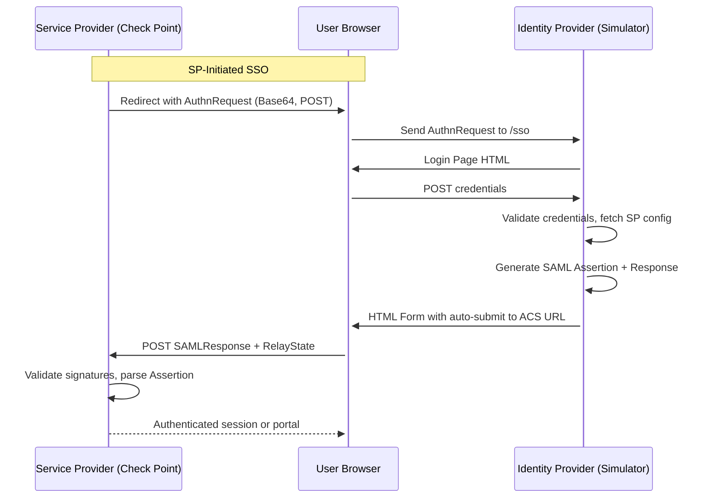

# 🛡️ SAML + SCIM IDP Simulator for Check Point

[](https://www.python.org/)
[](https://en.wikipedia.org/wiki/SAML_2.0)
[](https://datatracker.ietf.org/doc/html/rfc7644)
[](LICENSE)

---

## 🚀 Overview

The **SAML IDP Simulator** is a modern Identity Provider emulator tailored for **Check Point environments** (Harmony, Quantum, CloudGuard, SASE). It provides a **production-grade SAML SSO experience** plus an optional **SCIM 2.0 provisioning surface** for:

- Security PoCs
- Workshops and demos
- Integration testing — including **Harmony SASE SCIM provisioning**

✨ Featuring a full-featured **web admin portal**, **dynamic attribute mapping**, **realistic SAML flows**, and **bidirectional SCIM** (acts as both a SCIM server *and* a client that pushes to upstream SCIM endpoints like Harmony SASE).

---


---

## 🌟 Key Features

- 🔐 **SP-Initiated SSO** using signed SAML Response + Assertion
- 🧩 **Dynamic Attribute Mapping** via admin UI (claim → user field)
- 👤 **User Management** with modal-based edit/create/delete
- 🧪 **Multi-SP Support** with isolated configuration per SP
- 🔑 **X.509 Dual Signature** support
- 🕸️ **Web Login Flow** simulates realistic browser-based authentication
- 📁 **One-click Metadata / Certificate Download**
- ⚙️ **Admin Portal** for easy control and visibility

---

## 🧱 Architecture (SAML Flow)



---

## 💡 Typical Use Case

1. Configure your Check Point and add a new Identity Provider Object
2. Trigger login from SmartConsole / Portal
3. The simulator receives and parses the AuthnRequest
4. User logs in via the web interface
5. A signed SAML Response + Assertion is generated and POSTed back
6. Check Point logs the user in ✅

---

## 🛠️ Setup Instructions

### 🔧 Requirements

- Python 3.8+
- Flask
- signxml, lxml, flask-wtf, flask-limiter
- All dependencies: `pip install -r requirements.txt`

### 📦 Install & Run

```bash
# Clone the repo
git clone https://github.com/alshawwaf/SAML_IDP_Simulator.git
cd SAML_IDP_Simulator

# Install dependencies
python -m venv .venv
source .venv/bin/activate
pip install -r requirements.txt

# Run
python run.py
```

### 🐳 Optional: Run with Docker

```bash
docker build -t saml-idp-simulator .
docker run -p 5000:5000 \
  -e CERT_PATH=/app/certs/idp-cert.pem \
  -e KEY_PATH=/app/certs/idp-key.pem \
  saml-idp-simulator
```

### 🔄 SSL Toggle

Set `ENABLE_SSL=false` to run without HTTPS (useful behind a reverse proxy):

```bash
docker run -p 5000:5000 -e ENABLE_SSL=false saml-idp-simulator
```

---

## ⚙️ Configuration

### .env File

```bash
ADMIN_USERNAME="admin@cpdemo.ca"
ADMIN_PASSWORD="Cpwins!1@2026"
SECRET_KEY="Super-very-secret-key"
IDP_HOST="localhost"
IDP_PORT="5000"
DEFAULT_SP_ENTITY_ID="https://your-sp.example.com/acs/id/..."
DEFAULT_SP_ACS_URL="https://your-sp.example.com/acs/sso"
SSO_SERVICE_URL="https://localhost:5000/sso"
FLASK_DEBUG=1
```

---

## 🔐 Admin Portal

> 🧭 Navigate to `https://localhost:5000/admin`

**Default Credentials:**
- Username: `admin@cpdemo.ca`
- Password: `Cpwins!1@2026`

### 🔹 SP Management

- Add/edit SPs with:
  - Name, Entity ID, ACS URL
  - Claim-to-user-field mapping
- Configure multiple SPs independently

### 🔹 User Management

- Add/edit/delete users
- Auto-populated field mappings
- Password hashing included

---

## 🔄 Endpoints

### SAML
| Endpoint           | Description                      |
|--------------------|----------------------------------|
| `/sso`             | Handles incoming AuthnRequest    |
| `/login`           | Login form                       |
| `/logout`          | Logs the user out                |
| `/metadata`        | SAML metadata XML                |
| `/download-cert`   | Public certificate download      |
| `/admin`           | Admin UI                         |

### SCIM 2.0 (only when `ENABLE_SCIM=true`)
| Endpoint                          | Description                                  |
|-----------------------------------|----------------------------------------------|
| `/scim/v2/ServiceProviderConfig`  | RFC 7644 §5 capability advertisement         |
| `/scim/v2/ResourceTypes`          | User + Group resource types                  |
| `/scim/v2/Schemas`                | Schema definitions                           |
| `/scim/v2/Users` (+ `/<id>`)      | GET/POST/PUT/PATCH/DELETE, bearer auth       |
| `/scim/v2/Groups` (+ `/<id>`)     | Same — full CRUD                             |
| `/scim/v2/.search`                | POST search across User + Group              |
| `/admin/scim/`                    | Admin UI: targets, tokens, push log          |

---

## 🧪 Check Point Integration Steps

1. **In SmartConsole**:
   - Create an Identity Provider object
   - Set ACS URL and Entity ID
   - Upload metadata or public certificate

2. **In the Simulator**:
   - Add SP config via admin UI
   - Ensure ACS/Entity ID matches
   - Start login from SmartConsole → simulate SSO

✅ Ensure the user exists in both systems.

---

## 🔁 SCIM 2.0 (optional)

The simulator can also speak SCIM 2.0 — both as a **server** (so Entra ID / Okta can push users into it) and as a **client** (so it can push users out to a Check Point Harmony SASE tenant).

**Enable it — one variable:**

```bash
# Add to .env (or your Dokploy environment)
ENABLE_SCIM=true
```

That's it. On first boot the simulator will:
- Derive the token-encryption key from `SECRET_KEY` (no manual `SCIM_ENCRYPTION_KEY` needed — set one explicitly only if you want to decouple from `SECRET_KEY` rotation)
- Auto-generate a default inbound bearer token, log it prominently in the startup log, and write it to `data/.scim-bootstrap-token` for retrieval
- Surface the token in a banner on the SCIM admin dashboard the first time you visit it (click "Acknowledge" to delete the bootstrap file)

When `ENABLE_SCIM=true`:
- `/scim/v2/{Users,Groups,ServiceProviderConfig,ResourceTypes,Schemas,.search}` exposed with bearer-token auth
- A new **SCIM** dropdown appears in the admin nav: manage outbound targets (Harmony tenants), inbound bearer tokens, and inspect the SCIM push log
- One-click Harmony SASE region presets (US / EU / AU / IN) on the target form
- Round-trip with Entra ID, Okta, and JumpCloud-style SCIM clients

When `ENABLE_SCIM=false` (the default), the SAML flow runs exactly as before — no new tables created, no new routes registered.

See [docs/SCIM_PLAN.md](docs/SCIM_PLAN.md) for the full design, Harmony SASE quirks, and compliance notes.

---

## 📄 License

Licensed under the [MIT License](LICENSE)

---

## 🙌 Contributions Welcome

Feel free to fork, improve, and submit PRs!

---

> Created by [@alshawwaf](https://github.com/alshawwaf) for internal Check Point use, PoC enablement, and community SAML simulation.
