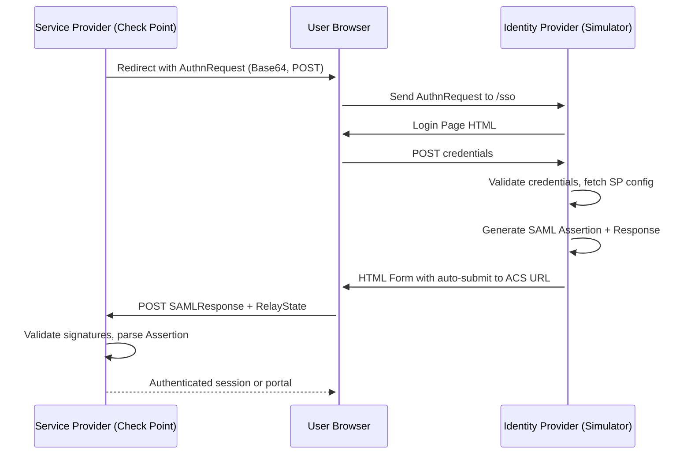

# SAML + SCIM IDP Simulator

[](https://www.python.org/)
[](https://en.wikipedia.org/wiki/SAML_2.0)
[](https://datatracker.ietf.org/doc/html/rfc7644)
[](LICENSE)

An Identity Provider emulator for Check Point demos and PoCs. Speaks SAML 2.0 (SP-initiated SSO with signed assertions) and optionally SCIM 2.0 (bidirectional — receives provisioning pushes from Entra ID / Okta *and* pushes users into a Check Point SASE tenant).


---

## Credentials

### Admin portal — `/admin/login`

| | |
|---|---|
| **URL** | `https://<your-host>/admin/login` |
| **Username** | `admin@cpdemo.ca` |
| **Password (default)** | `CpDemo2026` |

**Change the password after first login** — open **Settings → Change Admin Password** in the admin UI. The new password is stored as a PBKDF2-SHA256 hash at `/app/data/.admin-password-hash` (on the `saml_idp_data` volume) and survives redeploys.

Three precedence levels at login time:

1. If `/app/data/.admin-password-hash` exists (someone changed it via the UI), that hash is checked first
2. Otherwise, the `ADMIN_PASSWORD` env var if set in Dokploy
3. Otherwise, the default `CpDemo2026`

To revert to step 2/3, click **Settings → Reset to env/default** (or delete the hash file from the container terminal).

Username is `ADMIN_USERNAME` env var, default `admin@cpdemo.ca`.

### Demo SAML users — used at the `/login` form when an SP triggers SSO

| Username | Email | Password |
|---|---|---|
| `demo.user` | `demo.user@cpdemo.ca` | `Cpwins!1@2026` |
| `john.smith` | `john.smith@cpdemo.ca` | `Cpwins!1@2026` |
| `jane.doe` | `jane.doe@cpdemo.ca` | `Cpwins!1@2026` |

These are seeded into the database on first boot and survive redeploys. Change passwords after deploy via **Admin → Users → Reset Password**.

---

## Quick start

### Dokploy (recommended)

1. Create a new application pointing at `https://github.com/alshawwaf/SAML_IDP_Simulator` (`main` branch, Docker Compose build type).
2. Add a domain in the Dokploy Domains tab — port `5000`, service `saml-idp`, HTTPS via Let's Encrypt.
3. Click **Deploy**. First build is ~2 minutes.
4. (Optional) Set `ENABLE_SCIM=true` in the Environment tab and redeploy to enable the SCIM surface.

### Local development

```bash
git clone https://github.com/alshawwaf/SAML_IDP_Simulator.git
cd SAML_IDP_Simulator

python3 -m venv .venv
source .venv/bin/activate
pip install -r requirements.txt

python entrypoint.py    # generates a self-signed cert + starts Flask on port 9001
```

### Docker (without Dokploy)

```bash
docker build -t saml-scim-idp .
docker run -p 5000:5000 \
  -e IDP_PORT=5000 \
  -e IDP_HOST=0.0.0.0 \
  -e ENABLE_SSL=false \
  saml-scim-idp
```

---

## Configuration

All configuration is via environment variables. Defaults work out of the box.

### Core

| Variable | Default | Purpose |
|---|---|---|
| `IDP_PORT` | `5000` (Docker) / `9001` (local) | Port Flask binds to |
| `IDP_HOST` | `0.0.0.0` | Bind address |
| `ENABLE_SSL` | `false` | Serve HTTPS directly. Set `false` when behind a reverse proxy like Traefik/Dokploy. |
| `FLASK_DEBUG` | `0` | Enable Flask debug mode. Off by default (debug mode exposes the Werkzeug console — never enable in production). |
| `SECRET_KEY` | auto-generated | Flask session signing key (also derives the SCIM token-encryption key). If unset, a strong random key is generated and persisted to the data volume on first boot, stable across redeploys. Set explicitly to pin a value. **Never hardcode it in source/compose.** |
| `ADMIN_USERNAME` | `admin@cpdemo.ca` | Admin portal username |
| `ADMIN_PASSWORD` | `CpDemo2026` | Default works out-of-the-box. Change in **Admin → Settings → Change Admin Password** after first login, or set this env var to lock a specific value. |
| `IDP_ENTITY_ID` | `https://idp.cpdemo.ca` | SAML `entityID` advertised in metadata |
| `SSO_SERVICE_URL` | `https://idp.cpdemo.ca/sso` | SAML SSO endpoint URL in metadata |
| `CERT_PATH` | `app/certs/idp-cert.pem` | Path to the SAML signing cert (generated on first boot if missing) |
| `KEY_PATH` | `app/certs/idp-key.pem` | Path to the SAML private key |
| `USE_GUNICORN` | `true` (Docker) | Serve via gunicorn. Set `false`/unset for the Flask dev server (local runs). |
| `GUNICORN_WORKERS` | `2` | gunicorn worker count when `USE_GUNICORN=true`. |

### SCIM 2.0 (optional)

| Variable | Default | Purpose |
|---|---|---|
| `ENABLE_SCIM` | `false` | Master switch. `true` exposes `/scim/v2/*` and the SCIM admin pages. |
| `SCIM_PUSH_ON_USER_CHANGE` | `false` | Auto-push admin user CRUD to enabled outbound targets |
| `SCIM_ENCRYPTION_KEY` | derived from `SECRET_KEY` | Fernet key for outbound-bearer-token storage. Override only if you want SCIM tokens to survive a `SECRET_KEY` rotation. |
| `SCIM_BASE_PATH` | `/scim/v2` | URL prefix for SCIM server endpoints |

---

## SAML usage

### Configure a Check Point SP

1. **In the simulator**: log in to `/admin/`, open **Service Providers**, click **Add SP**. Set Name, Entity ID, ACS URL, and the claim → user-field mapping.
2. **In the Check Point product** (SmartConsole, Harmony Connect, Check Point SASE, etc.): create an Identity Provider object. Set ACS URL and Entity ID to match. Upload the simulator's metadata from `/download-metadata` or paste the cert from `/download-cert`.
3. **Trigger SSO** from the SP. The browser is redirected to `/sso?SAMLRequest=...`, the user logs in with one of the demo credentials, and the simulator returns a signed `Response` POSTed to the SP's ACS URL.

### Check Point Service Provider examples

These four Check Point integrations have been validated end-to-end, and **all four ship pre-seeded as templates** with placeholder Entity ID / ACS URLs. On a fresh deploy, open **Admin → Service Providers**, click the pencil on each, and replace the placeholders with your environment's values — the attribute mappings below come pre-filled.

In each Check Point product you copy out its **Entity ID** and **ACS / Reply URL** to paste here, and you upload this IdP's metadata (`/download-metadata`) or certificate (`/download-cert`) on the Check Point side. The IdP signs both the Assertion and the Response, so all four accept it.

#### 1. SmartConsole — administrator login SAML (R81.20+)

| Field | Value |
|---|---|
| **Entity ID** | `https://<your-mgmt-host>/cpmws/saml/acs/id/<sp-id>` |
| **ACS URL** | `https://<your-mgmt-host>/cpmws/saml/acs/sso` |

| Claim name | User field |
|---|---|
| `username` | `username` |
| `groups` | `groups` |

> SmartConsole validates the **signed `<Response>`** (not just the assertion) — the IdP does this automatically. Create the matching Administrator in SmartConsole with the SAML identity provider as its authentication method.

#### 2. Infinity Portal — Generic SAML Server

| Field | Value |
|---|---|
| **Entity ID** | `<your-tenant-id>.cloudinfra.checkpoint.com` |
| **ACS / Reply URL** | `https://cloudinfra-gw-<region>.portal.checkpoint.com/api/saml/sso` (region: `us` / `eu` / `au` / `in`) |

| Claim name | User field |
|---|---|
| `identity/claims/givenname` | `first_name` |
| `identity/claims/name` | `last_name` |
| `identity/claims/emailaddress` | `email` |
| `groups` | `groups` |
| `urn:mace:dir:attribute-def:userId` | `user_id` |

> All five claims are **mandatory and must be non-empty**. Map the `userId` claim to **`user_id`** (the stable per-user UUID) — not `external_id`, which is empty unless the user was SCIM-provisioned. The IdP omits empty attributes, which fails the portal's "User ID" check.

#### 3. Identity Awareness — Captive Portal SAML

| Field | Value |
|---|---|
| **Entity ID** | `https://<your-gateway>/connect/spPortal/ACS/ID/<sp-id>` |
| **ACS URL** | `https://<your-gateway>/connect/spPortal/ACS/Login/<sp-id>` |

| Claim name | User field |
|---|---|
| `username` | `email` |

> The same `<sp-id>` appears in both the Entity ID and the ACS path. NameID is the user's email.

#### 4. Remote Access VPN — SAML

| Field | Value |
|---|---|
| **Entity ID** | `https://<your-gateway>/saml-vpn/spPortal/ACS/ID/<sp-id>` |
| **ACS URL** | `https://<your-gateway>/saml-vpn/spPortal/ACS/Login/<sp-id>` |

| Claim name | User field |
|---|---|
| `username` | `email` |
| `group attr` | `groups` |

> Same shape as Identity Awareness but under the gateway's `/saml-vpn/` portal. The `group attr` claim name contains a space — enter it exactly.

### SAML SSO flow



---

## SCIM 2.0 usage

SCIM is off by default. Set `ENABLE_SCIM=true` and redeploy. The simulator works in two directions:

| Direction | Mode | When |
|---|---|---|
| **Inbound** | SCIM server at `/scim/v2/*` | External IdPs (Entra ID, Okta, JumpCloud) push users *into* the simulator. Useful for offline SCIM client testing. |
| **Outbound** | SCIM client | The simulator pushes users *to* Check Point SASE (or any RFC 7644 server). This is the production flow for Check Point SASE demos. |

### What happens on first boot with `ENABLE_SCIM=true`

The simulator auto-generates an inbound bearer token and prints it in the startup log:

```
======================================================================
SCIM default inbound bearer token (auto-generated)
  Token: <43-character-token>
  Bootstrap file: /app/data/.scim-bootstrap-token
  Use as: Authorization: Bearer <token>
  Manage at /admin/scim/inbound-tokens
======================================================================
```

The token is also persisted to `/app/data/.scim-bootstrap-token` and surfaced in a banner on `/admin/scim/`. Hand it to the upstream IdP and point its SCIM tenant URL at `https://<your-host>/scim/v2`.

### Pushing to Check Point SASE

The full walkthrough — including the workaround for Check Point SASE's Entra-ID-only SCIM connector requirement — is in [`docs/USER_GUIDE.md`](docs/USER_GUIDE.md). Short version:

1. In Check Point SASE: **Settings → Identity Providers → Add Microsoft Entra ID** (use dummy credentials), check **SCIM Integration**, click **Settings → Generate Token**, copy the Tenant URL and token.
2. In the simulator: **Admin → SCIM → Outbound Targets → Add Target**, click the matching region preset (US / EU / AU / IN), paste the Check Point SASE token, save.
3. Click **Test** to verify, then **Sync All** to push the demo users.

Every outbound request is logged to **Admin → SCIM → Push Log** with full request and response bodies — useful for live demos.

---

## Endpoint reference

### SAML

| Endpoint | Description |
|---|---|
| `/` | Landing page |
| `/sso` | Handles incoming `AuthnRequest` |
| `/login` | Login form (target of POST from `/sso`) |
| `/logout` | Logs the user out |
| `/metadata` | SAML metadata XML |
| `/download-metadata` | Same as `/metadata`, downloaded as a file |
| `/download-cert` | SAML signing certificate (public, PEM) |
| `/admin/` | Admin portal |

### SCIM 2.0 (only when `ENABLE_SCIM=true`)

| Endpoint | Description |
|---|---|
| `/scim/v2/ServiceProviderConfig` | RFC 7644 §5 capability advertisement |
| `/scim/v2/ResourceTypes` | User + Group resource types |
| `/scim/v2/Schemas` | Schema definitions |
| `/scim/v2/Users` (+ `/<id>`) | GET / POST / PUT / PATCH / DELETE, bearer auth |
| `/scim/v2/Groups` (+ `/<id>`) | Same surface, bearer auth |
| `/scim/v2/.search` | POST search across User + Group |
| `/admin/scim/` | SCIM admin dashboard |
| `/admin/scim/targets` | Outbound SCIM targets (Check Point SASE tenants) |
| `/admin/scim/inbound-tokens` | Inbound bearer tokens |
| `/admin/scim/log` | Push log (request / response audit) |

---

## Architecture & security notes

- SAML signing uses X.509 with `signxml`. Cert and key are auto-generated on first boot (`entrypoint.py`) and persisted to the `saml_idp_certs` Docker volume.
- SP-initiated SSO emits a **signed** SAML assertion (RSA-SHA256, exclusive C14N, enveloped signature on the assertion). The incoming `AuthnRequest` is parsed with a hardened parser (no DTD / no external entities) to prevent XXE.
- `SECRET_KEY` is generated and persisted to the data volume when not provided via env — it is never hardcoded.
- Admin (`/admin/login`) and SSO (`/login`) login endpoints are rate-limited via Flask-Limiter.
- `FLASK_DEBUG` is off by default; the container serves through gunicorn (`USE_GUNICORN=true`), not the Flask dev server.
- SQLite database lives at `/app/data/app.db` in the persisted `saml_idp_data` volume. Survives Dokploy redeploys.
- Inbound SCIM bearer tokens are stored as SHA-256 hashes (constant-time compared on auth).
- Outbound SCIM bearer tokens (to Check Point SASE) are Fernet-encrypted at rest. The encryption key is derived deterministically from `SECRET_KEY` unless `SCIM_ENCRYPTION_KEY` is set explicitly.
- `/scim/v2/*` endpoints are CSRF-exempt (they use bearer tokens, not cookies). Admin pages keep CSRF protection.
- Every outbound SCIM push is recorded in `ScimPushLog` with full request and response bodies.

---

## Documentation

| Doc | Audience |
|---|---|
| [docs/USER_GUIDE.md](docs/USER_GUIDE.md) | Operator walkthrough with screenshots — for Check Point SEs running demos. Also available as [USER_GUIDE.docx](docs/USER_GUIDE.docx) for Teams distribution. |
| [docs/SCIM_PLAN.md](docs/SCIM_PLAN.md) | Design and architecture of the SCIM extension, including known compliance gaps |

---

## Project structure

```
app/
  routes/
    auth.py          # /sso, /login, /logout
    metadata.py      # /, /metadata, /download-metadata
    admin.py         # /admin/* (user + SP management)
    scim/
      server.py      # /scim/v2/* SCIM server endpoints
      client.py      # Outbound SCIM client (ScimClient)
      admin.py       # /admin/scim/* admin UI
      auth.py        # Bearer-token decorator
      mappers.py     # DB <-> SCIM JSON mapping
      filters.py     # SCIM filter -> SQLAlchemy
      patch.py       # PatchOp interpreter
      sync.py        # Auto-push hooks
      bootstrap.py   # First-boot SCIM seed
  templates/         # Jinja templates (Bootstrap dark theme)
  static/            # CSS, JS, certs
  utils/
    models.py        # User, ServiceProvider
    models_scim.py   # ScimTarget, ScimInboundToken, ScimGroup, ScimPushLog
    config_manager.py
    crypto.py        # Fernet wrappers for SCIM token storage
docs/                # USER_GUIDE.md, SCIM_PLAN.md, build scripts
```

---

## License

[MIT License](LICENSE)

---

## Contributing

PRs welcome. Open an issue first for significant changes.

---

Created by [@alshawwaf](https://github.com/alshawwaf) for Check Point PoC enablement.
