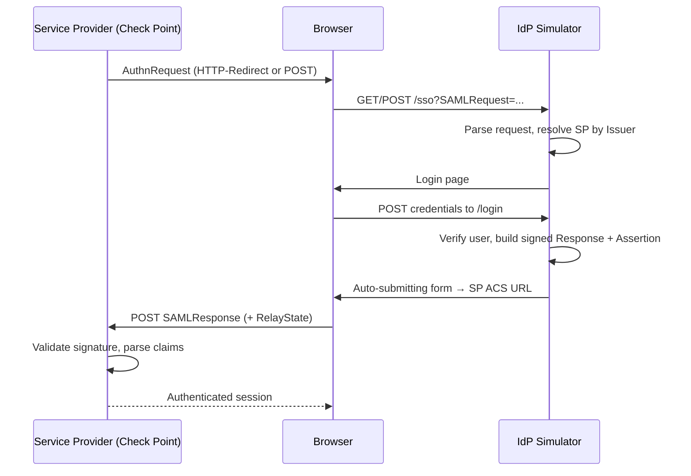

<div align="center">

# Identity Provider (IdP) Simulator

_A full Identity Provider simulator — SAML SSO + SCIM provisioning — for Check Point security POCs._

**A self-hosted Identity Provider for testing Check Point SAML SSO and SCIM provisioning integrations.**

[](https://www.python.org/)
[](https://en.wikipedia.org/wiki/SAML_2.0)
[](https://datatracker.ietf.org/doc/html/rfc7644)
[](https://flask.palletsprojects.com/)
[](LICENSE)


</div>

---

## Overview

Standing up a real identity provider (Entra ID, Okta, …) just to demo or troubleshoot a Check Point SAML or SCIM integration is slow and brittle. This project is a lightweight IdP you fully control: point a Check Point Service Provider at it, sign in with a demo user, and get back a properly **signed SAML Response** — or flip on SCIM and push users into a Check Point SASE tenant.

It is built for Check Point Sales Engineers and PoC teams, and its SAML flow has been **validated end-to-end against five Check Point products** (see below). The same box also plays the AAA server — RADIUS and TACACS+ — so one deployment covers SAML SSO, SCIM provisioning, *and* Gaia/gateway RADIUS/TACACS+ auth.

- **SAML 2.0** — SP-initiated SSO with a signed Response *and* signed Assertion, multiple Service Providers, first-class Groups (Entra/Okta-style UUIDs), and per-SP claim-to-attribute mapping.
- **SCIM 2.0** — bidirectional: an inbound SCIM server (Entra ID / Okta push *in*) and an outbound SCIM client (push users *out* to Check Point SASE).
- **RADIUS & TACACS+** — full auth/accounting RADIUS server (UDP 1812/1813) and a TACACS+ server (TCP), with per-user TOTP MFA (authenticator-app enrollment), Gaia role-based admin authorization, and a live click-to-open auth log.
- **Admin UI** — manage users, Groups, Service Providers, SCIM targets, and RADIUS/TACACS+ settings; download metadata/cert; inspect a full provisioning and activity audit log.

## Table of contents

- [Validated Check Point integrations](#validated-check-point-integrations)
- [Quick start](#quick-start)
- [Credentials](#credentials)
- [Configuration](#configuration)
- [SAML usage](#saml-usage)
- [SCIM 2.0 usage](#scim-20-usage)
- [RADIUS & TACACS+ usage](#radius--tacacs-usage)
- [Endpoint reference](#endpoint-reference)
- [Architecture & security](#architecture--security)
- [Troubleshooting](#troubleshooting)
- [Project layout](#project-layout)
- [Documentation](#documentation)
- [License](#license)

## Validated Check Point integrations

The five integrations below have been tested through a full login round-trip. **Each ships pre-seeded** with the reference lab's actual values as a concrete, ready-to-inspect example — on a fresh deploy you replace the Entity ID / ACS URL with your own environment's values; the attribute mappings are already filled in. Step-by-step recipes are in [SAML usage](#check-point-service-provider-recipes).

| Product | Integration | Key requirement |
|---|---|---|
| **SmartConsole** | Administrator login SAML (R81.20+) | IdP signs the `<Response>` (handled automatically) |
| **Infinity Portal** | Generic SAML Server | `userId` claim must be non-empty → mapped to `user_id` |
| **Identity Awareness** | Captive Portal SAML | NameID = email; single `username → email` claim |
| **Remote Access VPN** | Gateway `saml-vpn` portal SAML | `username → email` + `group attr → groups` |
| **Identity & Trust** | Generic SAML Server (Infinity) | Same as Infinity Portal, distinct tenant |

## Quick start

### Dokploy (recommended)

Deploys straight from this repo — no YAML to paste, and `git push` redeploys.

1. Create a **Compose** service. Under **Provider**, choose **GitHub** (or the
   **Git** provider with the public URL), pick this repo + the `main` branch,
   and set **Compose Path** to `docker-compose.yml`.
2. In the **Environment** tab, set your domain (secrets optional — all have safe
   defaults):
   ```
   IDP_DOMAIN=idp.yourlab.example
   # optional overrides:
   ADMIN_PASSWORD=change-me
   SECRET_KEY=<openssl rand -base64 48>
   RADIUS_SECRET=change-me
   TACACS_SECRET=change-me
   ```
3. Toggle **Autodeploy** on (redeploy on push), then **Deploy** (first build ≈ 2 min).

SCIM is **on by default** — no flag needed. Toggle it off from the admin dashboard, or set `ENABLE_SCIM=false` to force it off at deploy time.

**Open the host firewall** for the AAA protocols — they're published on the host
because Traefik only proxies HTTP: `udp/1812` + `udp/1813` (RADIUS) and `tcp/49`
(TACACS+). The web UI is served on `IDP_DOMAIN` via Traefik. On hardened Docker
hosts these ports can be silently dropped even when published — if RADIUS/TACACS+
time out with nothing in the Live log, see
[docs/RADIUS_TACACS_FIREWALL.md](docs/RADIUS_TACACS_FIREWALL.md).

Then point Check Point at it:

| Protocol | Where | Secret |
|---|---|---|
| SAML / SCIM | `https://IDP_DOMAIN` (download metadata from the home page) | — |
| RADIUS | `your-host:1812` | `RADIUS_SECRET` |
| TACACS+ | `your-host:49` | `TACACS_SECRET` |

Data (users, Service Providers, certs, RADIUS/TACACS settings) persists in the
`saml_idp_data` / `saml_idp_certs` volumes across redeploys.

> **Tip:** with **Autodeploy** off, click **Deploy** (or **Reload**) after each push.

### Docker

```bash
docker build -t saml-scim-idp .
docker run -p 5000:5000 \
  -e IDP_PORT=5000 \
  -e IDP_HOST=0.0.0.0 \
  -e ENABLE_SSL=false \
  saml-scim-idp
```

### Local development

```bash
git clone https://github.com/alshawwaf/SAML_IDP_Simulator.git
cd SAML_IDP_Simulator

python3 -m venv .venv
source .venv/bin/activate
pip install -r requirements.txt

python entrypoint.py    # generates a self-signed cert + starts Flask on port 9001
```

## Credentials

> Demo credentials are intentionally documented so the tool works out of the box. **Change them after first login** for anything internet-facing.

### Admin portal — `/admin/login`

| | |
|---|---|
| **Username** | `admin@cpdemo.ca` (override with `ADMIN_USERNAME`) |
| **Password** | `CpDemo2026` (default) |

Change it under **Settings → Change Admin Password**. The new password is stored as a PBKDF2-SHA256 hash on the persisted volume (`/app/data/.admin-password-hash`) and survives redeploys. Password resolution at login time:

1. The custom hash file, if you set a password via the UI; else
2. the `ADMIN_PASSWORD` environment variable, if set; else
3. the built-in default `CpDemo2026`.

Use **Settings → Reset to env/default** to remove the override.

### Demo SAML users — used at the `/login` form during SSO

| Username | Email | Password |
|---|---|---|
| `demo.user` | `demo.user@cpdemo.ca` | `Cpwins!1@2026` |
| `john.smith` | `john.smith@cpdemo.ca` | `Cpwins!1@2026` |
| `jane.doe` | `jane.doe@cpdemo.ca` | `Cpwins!1@2026` |

Seeded on first boot; persist across redeploys. Reset passwords under **Admin → Users**.

## Configuration

All configuration is via environment variables — defaults work out of the box.

### Core

| Variable | Default | Purpose |
|---|---|---|
| `IDP_PORT` | `5000` (Docker) / `9001` (local) | Port the app binds to |
| `IDP_HOST` | `0.0.0.0` | Bind address |
| `ENABLE_SSL` | `false` | Serve HTTPS directly. Keep `false` behind a reverse proxy (Traefik/Dokploy). |
| `FLASK_DEBUG` | `false` | Flask debug mode. **Off by default** — debug mode exposes the Werkzeug console; never enable in production. |
| `SECRET_KEY` | _auto-generated_ | Signs session cookies and derives the SCIM token-encryption key. If unset, a strong key is generated and persisted to the data volume (stable across redeploys). Set explicitly to pin a value — **never hardcode it in source/compose**. |
| `ADMIN_USERNAME` | `admin@cpdemo.ca` | Admin portal username |
| `ADMIN_PASSWORD` | `CpDemo2026` | Default works out of the box; change via the UI or pin here |
| `IDP_ENTITY_ID` | _auto-derived_ | SAML `entityID` in metadata. Defaults to the deployment's public URL (e.g. `https://idp.example.com`); set only to pin a specific value. |
| `SSO_SERVICE_URL` | _auto-derived_ | SSO endpoint in metadata. Defaults to `<public-url>/sso`; set only to pin. |
| `CERT_PATH` | `app/certs/idp-cert.pem` | SAML signing certificate (generated on first boot if missing) |
| `KEY_PATH` | `app/certs/idp-key.pem` | SAML private key |
| `USE_GUNICORN` | `true` (Docker) | Serve via gunicorn. Unset/`false` uses the Flask dev server (local runs). |
| `GUNICORN_WORKERS` | `2` | gunicorn worker count |

### SCIM 2.0 (optional)

| Variable | Default | Purpose |
|---|---|---|
| `ENABLE_SCIM` | _on_ | SCIM is **on by default** and toggleable from the admin dashboard (no restart). Set `false` to force it off, overriding the portal toggle. |
| `SCIM_PUSH_ON_USER_CHANGE` | `false` | Auto-push admin user CRUD to enabled outbound targets |
| `SCIM_ENCRYPTION_KEY` | derived from `SECRET_KEY` | Fernet key for outbound-token storage. Set explicitly to decouple from `SECRET_KEY`. |
| `SCIM_BASE_PATH` | `/scim/v2` | URL prefix for the SCIM server |

## SAML usage

### Quick test — no Service Provider needed

A built-in **loopback test** verifies the IdP end-to-end on any deployment with zero configuration. Click **Try SAML SSO** on the landing page (or **Test SAML SSO** on the admin dashboard), sign in with a demo user, and you land on a page showing the decoded SAML Response, the parsed claims, and a **signature-verified** badge. It's seeded as the **Built-in SAML Test** Service Provider and posts to a loopback ACS (`/saml-test/acs`) on the IdP itself — a working example out of the box, before you wire up any Check Point product.

### How SP-initiated SSO works



### Configuring a Service Provider

1. **In the simulator** — log in to `/admin/`, open **Service Providers → Add Service Provider**. Set the Name, Entity ID, ACS URL, and the claim → user-field mappings.
2. **In the Check Point product** — create the SAML/Identity Provider object. Set its Entity ID and ACS to match, and import this IdP's metadata from `/download-metadata` (or paste the cert from `/download-cert`).
3. **Trigger SSO** from the product. The user is sent to `/sso`, signs in with a demo credential, and the simulator returns a signed Response auto-POSTed to the ACS URL.

### Check Point Service Provider recipes

Each product below shows the format; the seeded entry uses the reference lab's actual values (visible under **Service Providers**) as a concrete example. Replace the host / tenant / SP-ID parts (`<your-mgmt-host>`, `<sp-id>`, `<your-tenant-id>`, `<your-gateway>`, `<region>`) with your own. Copy the Entity ID and ACS / Reply URL out of the Check Point product. The IdP signs both the Assertion and the Response, so all five accept it.

<details open>
<summary><b>1. SmartConsole — administrator login SAML (R81.20+)</b></summary>

| Field | Value |
|---|---|
| **Entity ID** | `https://<your-mgmt-host>/cpmws/saml/acs/id/<sp-id>` |
| **ACS URL** | `https://<your-mgmt-host>/cpmws/saml/acs/sso` |

| Claim name | User field |
|---|---|
| `username` | `username` |
| `groups` | `groups` |

SmartConsole validates the **signed `<Response>`** (not just the assertion) — done automatically. Create the matching Administrator in SmartConsole with the SAML identity provider as its authentication method.

</details>

<details>
<summary><b>2. Infinity Portal — Generic SAML Server</b></summary>

| Field | Value |
|---|---|
| **Entity ID** | `<your-tenant-id>.cloudinfra.checkpoint.com` |
| **ACS / Reply URL** | `https://cloudinfra-gw-<region>.portal.checkpoint.com/api/saml/sso` (region: `us` / `eu` / `au` / `in`) |

| Claim name | User field |
|---|---|
| `identity/claims/givenname` | `first_name` |
| `identity/claims/name` | `last_name` |
| `identity/claims/emailaddress` | `email` |
| `groups` | `groups` |
| `urn:mace:dir:attribute-def:userId` | `user_id` |

All five claims are **mandatory and must be non-empty**. Map `userId` to **`user_id`** (the stable per-user UUID) — not `external_id`, which is empty unless the user was SCIM-provisioned (the IdP omits empty attributes, which fails the portal's "User ID" check).

</details>

<details>
<summary><b>3. Identity Awareness — Captive Portal SAML</b></summary>

| Field | Value |
|---|---|
| **Entity ID** | `https://<your-gateway>/connect/spPortal/ACS/ID/<sp-id>` |
| **ACS URL** | `https://<your-gateway>/connect/spPortal/ACS/Login/<sp-id>` |

| Claim name | User field |
|---|---|
| `username` | `email` |

The same `<sp-id>` appears in both the Entity ID and the ACS path. NameID is the user's email.

</details>

<details>
<summary><b>4. Remote Access VPN — SAML</b></summary>

| Field | Value |
|---|---|
| **Entity ID** | `https://<your-gateway>/saml-vpn/spPortal/ACS/ID/<sp-id>` |
| **ACS URL** | `https://<your-gateway>/saml-vpn/spPortal/ACS/Login/<sp-id>` |

| Claim name | User field |
|---|---|
| `username` | `email` |
| `group attr` | `groups` |

Same shape as Identity Awareness but under the gateway's `/saml-vpn/` portal. The `group attr` claim name contains a space — enter it exactly.

</details>

<details>
<summary><b>5. Identity & Trust — Generic SAML Server (Infinity)</b></summary>

| Field | Value |
|---|---|
| **Entity ID** | `<your-tenant-id>.cloudinfra.checkpoint.com` |
| **ACS / Reply URL** | `https://cloudinfra-gw-<region>.portal.checkpoint.com/api/saml/sso` |

| Claim name | User field |
|---|---|
| `identity/claims/givenname` | `first_name` |
| `identity/claims/name` | `last_name` |
| `identity/claims/emailaddress` | `email` |
| `groups` | `groups` |
| `urn:mace:dir:attribute-def:userId` | `user_id` |

Identity & Trust uses the same Generic SAML Server shape as Infinity Portal — same claims and regional ACS — under a separate tenant Entity ID.

</details>

## SCIM 2.0 usage

SCIM is **on by default** and can be flipped on/off from the admin dashboard's **SCIM Provisioning** card — the routes are always registered and gated by a runtime flag, so the toggle takes effect immediately (no restart). Set `ENABLE_SCIM=false` to force it off at deploy time. The simulator works in both directions:

| Direction | Mode | Use case |
|---|---|---|
| **Inbound** | SCIM server at `/scim/v2/*` | Entra ID / Okta / JumpCloud push users *into* the simulator — offline SCIM client testing |
| **Outbound** | SCIM client | The simulator pushes users *out* to Check Point SASE (or any RFC 7644 server) — the SASE demo flow |

### Inbound: the auto-generated bearer token

With SCIM enabled (the default), the simulator auto-generates an inbound bearer token, prints it to the startup log, and persists it to `/app/data/.scim-bootstrap-token`:

```
======================================================================
SCIM default inbound bearer token (auto-generated)
  Token: <43-character-token>
  Use as: Authorization: Bearer <token>
  Manage at /admin/scim/inbound-tokens
======================================================================
```

It's also shown in a banner on `/admin/scim/`. Hand it to the upstream IdP and point its SCIM tenant URL at `https://<your-host>/scim/v2`.

### Outbound: push to Check Point SASE

The simulator pushes users into a Check Point SASE (Harmony SASE / Perimeter 81) tenant as a SCIM client. The full screenshot walkthrough is in [`docs/USER_GUIDE.md`](docs/USER_GUIDE.md); the essentials:

> **The Entra ID workaround (the key trick).** Check Point SASE only exposes SCIM provisioning through its **Microsoft Entra ID** and **Okta** connectors — there is no "generic SCIM" option. So to get a SCIM endpoint + token, add a **Microsoft Entra ID** identity provider with **dummy credentials** (any domain, a UUID-shaped Client ID like `00000000-0000-0000-0000-000000000001`, any 20+ character secret) and tick **SCIM Integration**. Check Point does **not** validate the Entra credentials before issuing the SCIM token, so the simulator can then push as if it were Entra ID — no real Entra tenant required.

1. **In Check Point SASE** — *Settings → Identity Providers → + Add Provider → Microsoft Entra ID +SCIM*. Fill the form with the dummy values above, tick **SCIM Integration**, click **Done**. Then open **SCIM Integration → Settings → Generate Token** and copy the **Tenant URL** and the **bearer token** (shown once).
2. **In the simulator** — *Admin → SCIM → Outbound Targets → Add Target*. Click the matching **region preset** (US / EU / AU / IN) to fill the Base URL, paste the token, **Create Target**.
3. Click **Test** (expect HTTP 200), then **Sync All** to push the demo users.

Synced users appear in Check Point SASE under **Team → Members** with Identity Provider = Entra ID. Every outbound request is recorded in **Admin → SCIM → Push Log** with full request/response bodies — gold for narrating a live demo.

## RADIUS & TACACS+ usage

The same deployment runs an authentication/accounting **RADIUS** server and a **TACACS+** server against the same demo users, so you can validate Gaia / gateway auth without standing up a separate AAA box. Both protocol servers run in their own process (the web workers can't bind the sockets) and are supervised by `entrypoint.py`.

- **Where** — RADIUS on `udp/1812` (auth) + `udp/1813` (accounting); TACACS+ on `tcp/49` (mapped to container port `4949`). These are published on the **host IP**, not the Traefik web domain — Traefik only routes HTTP. The **Admin → RADIUS / TACACS+** pages show the reachable, auto-detected host address to point Gaia at.
- **Secrets** — shared secrets default to `testing123` (override with `RADIUS_SECRET` / `TACACS_SECRET`, or edit them in-app on the RADIUS / TACACS+ pages — the secret applies immediately).
- **MFA** — enable per-user TOTP under **Admin → RADIUS**; scan the QR into an authenticator app (or use the predictable demo passcode via `AAA_DEFAULT_OTP`, default `123456`). RADIUS then expects password + OTP.
- **Gaia role-based admin auth** — the servers return the vendor attributes Gaia uses to map an authenticated admin to a role, so RADIUS/TACACS+ admin login into Gaia works end-to-end.
- **Live log** — every request lands in **Admin → RADIUS / TACACS+ → Log** with a click-to-open detail modal (accept/reject, attributes, raw packet).

> If Gaia/NAS times out and the Live log stays **empty**, the packet never reached the app — a host/cloud firewall is dropping the published port. See **[docs/RADIUS_TACACS_FIREWALL.md](docs/RADIUS_TACACS_FIREWALL.md)**.

### AAA configuration

| Variable | Default | Purpose |
|---|---|---|
| `RADIUS_SECRET` | `testing123` | RADIUS shared secret (also editable in-app) |
| `RADIUS_AUTH_PORT` / `RADIUS_ACCT_PORT` | `1812` / `1813` | RADIUS auth / accounting ports |
| `TACACS_SECRET` | `testing123` | TACACS+ shared secret (also editable in-app) |
| `TACACS_PORT` | `4949` | TACACS+ port inside the container (host `49` maps to it) |
| `TACACS_PUBLIC_PORT` | `49` | Host-side TACACS+ port shown in the portal |
| `AAA_DEFAULT_OTP` | `123456` | Predictable TOTP passcode for MFA demo users |
| `AAA_BIND` | `0.0.0.0` | Bind address for the protocol servers |
| `PUBLIC_HOST` | _auto-detect_ | Pin the host address shown in the portal (NAT / offline labs) |

## Endpoint reference

<details>
<summary><b>SAML</b></summary>

| Endpoint | Description |
|---|---|
| `/` | Landing page |
| `/sso` | Receives the SP `AuthnRequest` (HTTP-Redirect or POST) |
| `/login` | Login form; returns the signed, auto-submitting SAML Response |
| `/logout` | Ends the session |
| `/metadata` · `/download-metadata` | IdP SAML metadata (inline / as a file) |
| `/download-cert` | Public SAML signing certificate (PEM) |
| `/saml-test` · `/saml-test/acs` | Built-in loopback SAML test (IdP-initiated) + decoded-assertion viewer |
| `/admin/` | Admin portal |

</details>

<details>
<summary><b>SCIM 2.0 — on by default (set <code>ENABLE_SCIM=false</code> to force off)</b></summary>

| Endpoint | Description |
|---|---|
| `/scim/v2/ServiceProviderConfig` | RFC 7644 §5 capability advertisement |
| `/scim/v2/ResourceTypes` · `/scim/v2/Schemas` | Discovery |
| `/scim/v2/Users` (+ `/<id>`) | GET / POST / PUT / PATCH / DELETE (bearer auth) |
| `/scim/v2/Groups` (+ `/<id>`) | Same surface (bearer auth) |
| `/scim/v2/.search` | POST search across Users + Groups |
| `/admin/scim/` | SCIM dashboard |
| `/admin/scim/targets` · `/admin/scim/inbound-tokens` · `/admin/scim/log` | Outbound targets, inbound tokens, push audit log |

</details>

<details>
<summary><b>Admin — RADIUS / TACACS+</b></summary>

| Endpoint | Description |
|---|---|
| `/admin/radius/` · `/admin/radius/log` | RADIUS settings + per-user MFA / live auth log |
| `/admin/tacacs/` · `/admin/tacacs/log` | TACACS+ settings + live auth log |
| `/admin/aaa/endpoint` | Auto-detected host address the portal shows for RADIUS/TACACS+ |

</details>

## Architecture & security

- **Signing** — assertions and the response are signed with X.509 via `signxml` (RSA-SHA256, exclusive C14N, enveloped signature placed immediately after `Issuer`). The cert/key are generated on first boot and persisted to the `saml_idp_certs` volume.
- **Hardened request parsing** — incoming `AuthnRequest`s are parsed with DTD/entity resolution disabled (no XXE).
- **Secrets** — `SECRET_KEY` is generated and persisted when not provided; it is never hardcoded. Outbound SCIM tokens are Fernet-encrypted at rest; inbound tokens are stored as SHA-256 hashes.
- **Auth & rate limiting** — admin and SSO login endpoints are rate-limited (Flask-Limiter). `/scim/v2/*` uses bearer tokens and is CSRF-exempt; the admin UI keeps CSRF protection.
- **Runtime** — `entrypoint.py` supervises two processes: gunicorn (web) and a single AAA process for the RADIUS/TACACS+ servers (kept separate because gunicorn's multiple workers can't each bind the protocol sockets); if either exits the container restarts clean. `FLASK_DEBUG` defaults off.
- **Audit log** — admin, auth, SAML, and SCIM changes are recorded to an activity log (**Admin → Activity**) with category/status filters and per-entry detail, alongside the SCIM push log.
- **Persistence** — SQLite lives at `/app/data/app.db` on the `saml_idp_data` volume and survives redeploys; demo users and the four SP templates are seeded only into an empty database.

## Troubleshooting

| Symptom | Cause & fix |
|---|---|
| SP rejects the response: *"…make sure the response is signed…"* | The SP (e.g. SmartConsole) wants the **Response** signed. The IdP signs both Response and Assertion — re-import the current `/metadata` / cert on the SP side. |
| Infinity Portal: *"User ID has not been resolved"* | Map `urn:mace:dir:attribute-def:userId` to a **non-empty** field — use `user_id`. Empty source fields are omitted from the assertion. |
| After login the browser lands on a `…/...` page (404) | You're on an old build where SSO was a stub. Redeploy `main`. |
| Every path returns a plain *"404 page not found"* | The reverse proxy (Traefik) has no healthy backend — the container isn't running. Check `docker logs <container>`. |
| Container crash-loops on boot | A dependency drift can break `signxml` — it requires `pyOpenSSL < 24` (pinned in `requirements.txt`). Don't unpin without testing. |
| Admin logged out / SCIM target "Test" fails after a redeploy | `SECRET_KEY` changed. Log in again; re-enter outbound SCIM tokens once. Pin `SECRET_KEY` in the env to avoid it. |
| RADIUS/TACACS+ time out from Gaia/NAS, **nothing** in the Live log | The packet never reached the app — a host/cloud firewall is dropping it (hardened Docker hosts filter published ports in `DOCKER-USER`). Empty log = network, not app. See **[docs/RADIUS_TACACS_FIREWALL.md](docs/RADIUS_TACACS_FIREWALL.md)**. |

## Project layout

```
app/
  routes/
    auth.py            # /sso, /login, /logout — SAML SSO
    metadata.py        # /, /metadata, /download-metadata
    admin.py           # /admin/* — user, Group + SP management, activity log
    radius.py          # /admin/radius/* — RADIUS settings, per-user MFA, log
    tacacs.py          # /admin/tacacs/* — TACACS+ settings, log
    aaa.py             # /admin/aaa/* — reachable-endpoint auto-detection
    scim/              # SCIM server, outbound client, admin UI, mappers, filters, patch
  services/
    runner.py          # supervises the RADIUS + TACACS+ protocol servers (own process)
    radius_server.py   # pyrad-based RADIUS auth/accounting server
    tacacs_server.py   # TACACS+ server
  templates/           # Jinja templates (Bootstrap dark theme)
  static/              # CSS, JS, certs
  utils/
    models.py          # User, ServiceProvider, Group
    models_scim.py     # ScimTarget, ScimInboundToken, ScimGroup, ScimPushLog
    models_aaa.py      # RADIUS/TACACS settings, per-user MFA/TOTP, AAA logs
    saml.py            # AuthnRequest parsing + signed Response/Assertion
    config_manager.py  # env-driven configuration
    crypto.py          # Fernet wrappers for SCIM token storage
entrypoint.py          # generates the cert, then supervises the AAA + web processes
docs/                  # USER_GUIDE.md, SCIM_PLAN.md, RADIUS_TACACS_FIREWALL.md
```

## Documentation

| Doc | Audience |
|---|---|
| [docs/USER_GUIDE.md](docs/USER_GUIDE.md) | Operator walkthrough with screenshots — for SEs running demos (also [USER_GUIDE.docx](docs/USER_GUIDE.docx) for Teams) |
| [docs/SCIM_PLAN.md](docs/SCIM_PLAN.md) | SCIM extension design and known compliance gaps |
| [docs/RADIUS_TACACS_FIREWALL.md](docs/RADIUS_TACACS_FIREWALL.md) | Fix RADIUS/TACACS+ reachability behind a hardened Docker host (UFW `DOCKER-USER`) — diagnosis, fix, persistence |

## Contributing

PRs welcome — please open an issue first for significant changes.

## License

[MIT](LICENSE) · Created by [@alshawwaf](https://github.com/alshawwaf) for Check Point PoC enablement.
