# SAML + SCIM IDP Simulator — User Guide

A complete walkthrough for configuring the simulator with **Check Point SASE** (formerly Harmony SASE / Perimeter 81) for end-to-end identity demos, including SAML SSO and SCIM 2.0 provisioning.

**Audience:** Check Point SEs running customer PoCs / demos.

**What you'll have at the end:** A live simulator at your own domain, syncing users into a real Check Point SASE tenant via SCIM, and able to receive SAML SSO requests from any Check Point product.

> **Note on screenshots in this guide:** the inline images live under [`docs/guide/images/`](guide/images/). To rebuild the `.docx` after dropping in new screenshots, run `./docs/build_user_guide.sh` from the project root.

---

## Table of contents

1. [What this tool does](#1-what-this-tool-does)
2. [Prerequisites](#2-prerequisites)
3. [Deploy on Dokploy](#3-deploy-on-dokploy)
4. [Enable SCIM on the simulator](#4-enable-scim-on-the-simulator)
5. [Configure Check Point SASE — the inbound side](#5-configure-check-point-sase--the-inbound-side)
6. [Configure the simulator — the outbound side](#6-configure-the-simulator--the-outbound-side)
7. [Sync users and verify](#7-sync-users-and-verify)
8. [Optional: auto-sync on admin changes](#8-optional-auto-sync-on-admin-changes)
9. [Optional: receive SCIM pushes (inbound mode)](#9-optional-receive-scim-pushes-inbound-mode)
10. [Troubleshooting](#10-troubleshooting)
11. [Appendix: defaults and references](#11-appendix-defaults-and-references)

---

## 1. What this tool does

The simulator is a Flask app that emulates a corporate Identity Provider for Check Point demos. It speaks two protocols:

| Protocol | Direction | When you use it |
|---|---|---|
| **SAML 2.0** | Inbound — Check Point products send `AuthnRequest`s, the simulator returns signed `Response`s | Demos of SAML SSO into Quantum gateways, SmartConsole, Check Point SASE web portal, etc. |
| **SCIM 2.0** | Both. As **server**, external IdPs (Entra/Okta) can push users *to* it. As **client**, it pushes users *to* Check Point SASE. | Demos of automated user provisioning. |

For the SCIM walkthrough below, you'll be using it in **outbound client mode** — the simulator pretends to be Microsoft Entra ID and pushes users into your Check Point SASE tenant.

---

## 2. Prerequisites

- **Dokploy** instance you can deploy to (or any other Docker-compose host).
- A **subdomain** pointing to your Dokploy box — e.g. `idp.ai.alshawwaf.ca`. Set the DNS `A` record before deploying so Let's Encrypt can issue a TLS cert.
- A **Check Point SASE tenant** with administrator access. Trial accounts work; SCIM is gated behind the Enterprise tier so make sure your trial includes it.
- **5–10 minutes** of clicking.

---

## 3. Deploy on Dokploy

### 3.1 Create the application

In Dokploy:

1. Open your **Project** → **+ Create Service** → **Application**
2. Name: `saml-scim-idp` (or whatever you prefer)
3. **Provider:** GitHub (or Git via HTTPS clone URL)
4. **Repository:** `alshawwaf/SAML_IDP_Simulator`
5. **Branch:** `main`
6. **Build Type:** Docker Compose
7. **Compose Path:** `docker-compose.yml`

### 3.2 Domain + HTTPS

In the **Domains** tab:

- **+ Add Domain** → `idp.<yourdomain>`
- Container Port: `5000`
- Container Service: `saml-idp` (from the compose file)
- **HTTPS: ON** → **Let's Encrypt**

### 3.3 Deploy

Click **Deploy**. First build takes ~2 min (installs Python deps + generates self-signed SAML cert at runtime).

After the deploy completes, browse to `https://idp.<yourdomain>/`. You should see the simulator homepage with the gradient "Identity Provider Made Simple" hero.

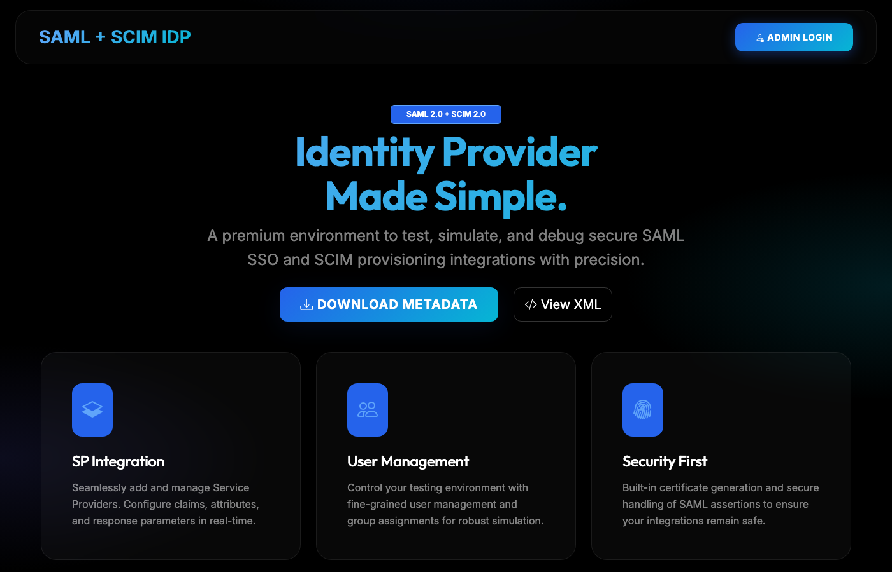

---

## 4. Enable SCIM on the simulator

By default the simulator only does SAML. SCIM is opt-in.

### 4.1 The clean path

In Dokploy → **Environment** tab → add this line and **Save**:

```
ENABLE_SCIM=true
```

Then **Redeploy** (or **Restart**).

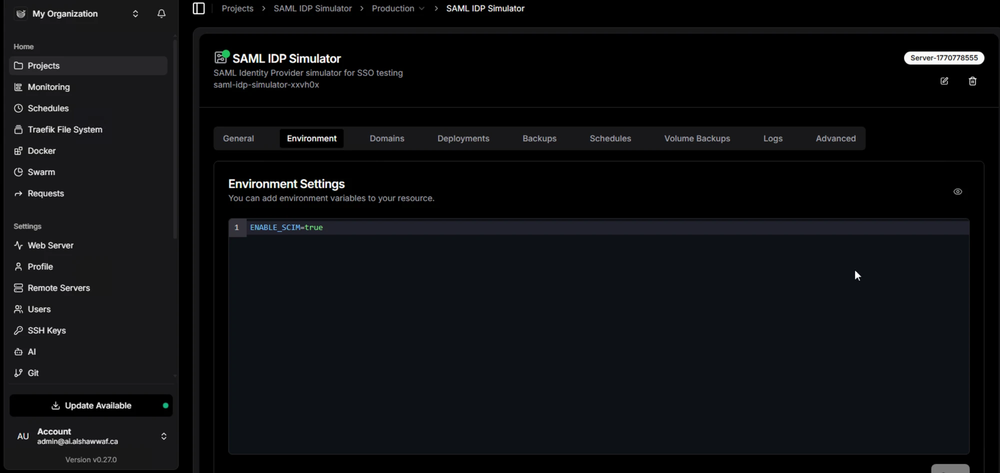

### 4.2 The fallback (if your Dokploy doesn't propagate env vars)

Some Dokploy versions don't pass Environment-tab values through docker-compose's variable substitution context. If after redeploy you still see `SCIM disabled` in the logs, use this fallback:

1. Open the container terminal in Dokploy (Docker sidebar → your container → Terminal)
2. Run:
   ```bash
   mkdir -p /app/data && touch /app/data/.enable-scim
   ```
3. Restart the container

The simulator checks for this marker file at boot and turns SCIM on. The file lives on the persisted `saml_idp_data` volume so it survives future redeploys.

### 4.3 Read the bootstrap token

On first boot with SCIM enabled, the simulator auto-generates a default inbound bearer token. You'll see this block in the Dokploy logs:

```
======================================================================
SCIM default inbound bearer token (auto-generated)
  Token: <43-character-token-string>
  Bootstrap file: /app/data/.scim-bootstrap-token
  Use as: Authorization: Bearer <token>
  Manage at /admin/scim/inbound-tokens
======================================================================
SCIM endpoints enabled at /scim/v2 (server) and /admin/scim (admin UI)
```

**Copy that token** — you'll need it later for the inbound side (or if you want external Entra/Okta to push to you).

The token is also written to `/app/data/.scim-bootstrap-token` and shown in a banner the first time you visit `/admin/scim/` in the admin UI.

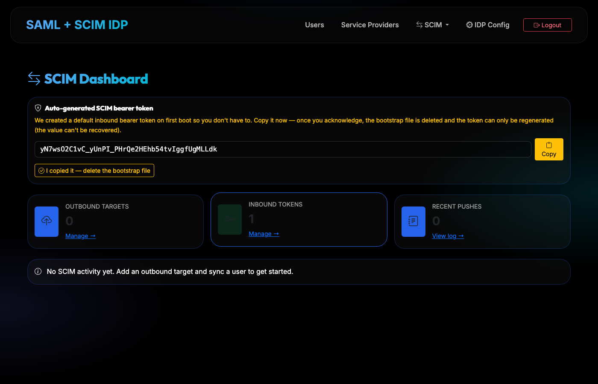

---

## 5. Configure Check Point SASE — the inbound side

Now configure Check Point SASE to give you a SCIM endpoint + token that the simulator will push to.

### 5.1 Open Identity Providers

In the Check Point SASE admin portal:

**Settings → Identity Providers → + Add Provider**


### 5.2 Pick Microsoft Entra ID

In the "Add identity provider" modal, you'll see 5 options:

- Google Workspace
- **Microsoft Entra ID +SCIM** ← pick this
- Okta +SCIM
- Active Directory / LDAP
- SAML 2.0 Identity Providers

Pick **Microsoft Entra ID** (the `+SCIM` badge means SCIM provisioning is supported for this connector). Click **Continue**.

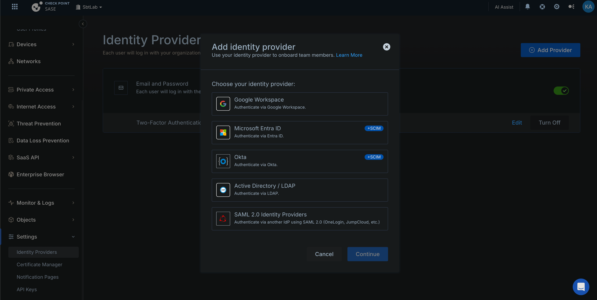

> **Why Entra ID and not "SAML 2.0 Identity Providers"?** Check Point SASE only badges Entra ID and Okta as SCIM-capable. There's no "generic SCIM" option. The simulator will pretend to be Entra ID — Check Point doesn't actually verify the Entra credentials before generating the SCIM endpoint, so this works even without a real Entra tenant.

### 5.3 Fill in the form with dummy values

The form will ask for:

| Field | What to enter |
|---|---|
| **Microsoft Entra ID Domain** | Any FQDN — e.g. `simulator.<yourdomain>` |
| **Domain Aliases** | Leave empty |
| **Client ID** | A UUID-shaped string or any plausible value — e.g. `00000000-0000-0000-0000-000000000001` |
| **Client Secret** | Any 20+ character string |
| ☑️ **SCIM Integration** | **Check this box — this is the key** |

Click **Done**.

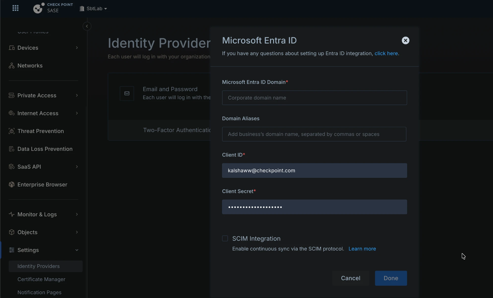

### 5.4 Generate the SCIM token

Back on the Identity Providers page, you'll now see:

- Microsoft Entra ID listed with your domain
- A green toggle (enabled)
- **SCIM Integration: On**
- A **Settings** link

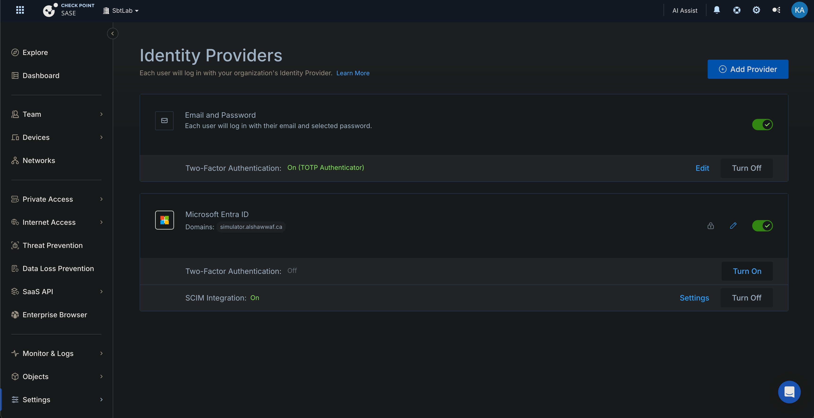

Click **Settings** next to SCIM Integration. This opens a panel with:

- **Tenant URL** — the base URL for SCIM pushes (e.g. `https://api.perimeter81.com/api/scim` for the US region, or your regional equivalent)
- **Generate Token** button

Click **Generate Token**. Check Point SASE shows the bearer token **once**. **Copy it immediately** and paste it somewhere safe (1Password, password manager).

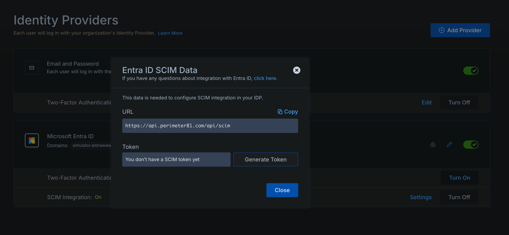

You now have:
- The **Tenant URL** (e.g. `https://api.perimeter81.com/api/scim`)
- The **Bearer Token** Check Point SASE issued

---

## 6. Configure the simulator — the outbound side

Now wire the simulator to push to that endpoint.

### 6.1 Open the SCIM admin UI

Log in to `https://idp.<yourdomain>/admin/`:

- Username: `admin@cpdemo.ca` (default)
- Password: `Cpwins!1@2026` (default — change in Dokploy env if desired)

Click the **SCIM** dropdown in the nav → **Outbound Targets**.

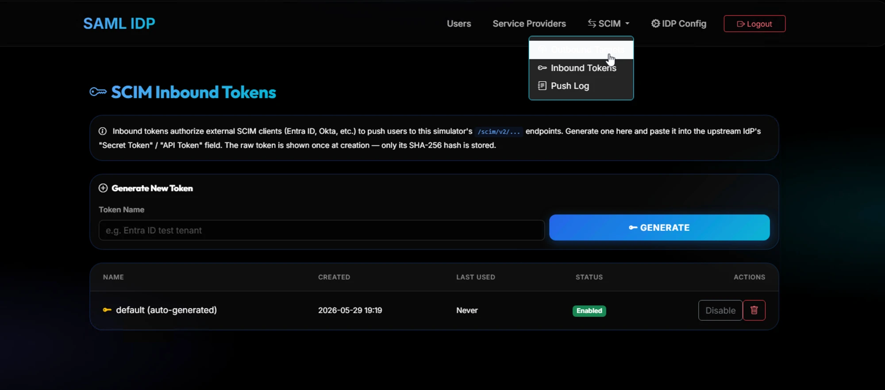

### 6.2 Add the target

Click **+ Add Target** and fill in:

| Field | Value |
|---|---|
| **Name** | Anything human-readable — e.g. `Check Point SASE - SBTLab` |
| **SCIM Base URL** | Click the matching **region preset** (US / EU / AU / IN) — fills in the URL automatically. Or paste the Tenant URL Check Point SASE gave you. |
| **Bearer Token** | Paste the token Check Point SASE generated |

Click **Create Target**.

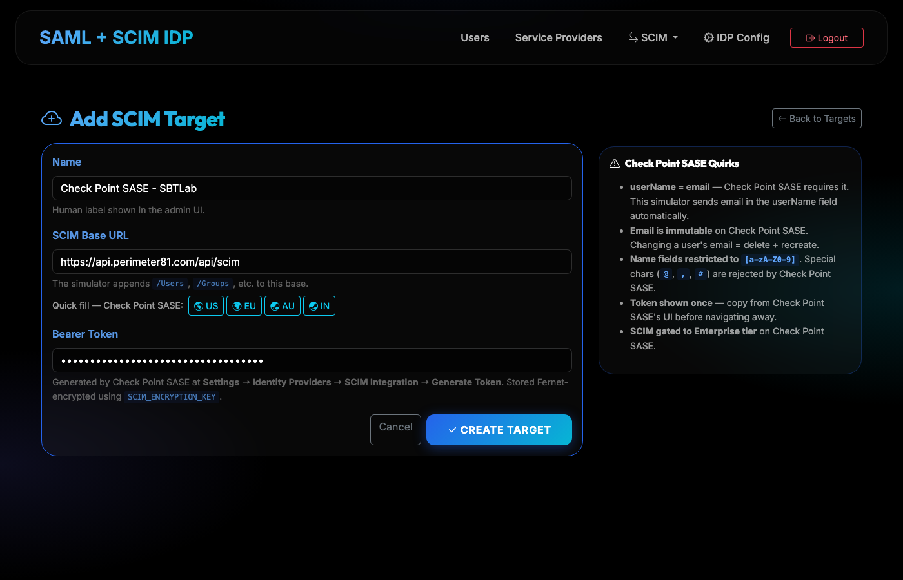

### 6.3 Test the connection

On the **SCIM Outbound Targets** page, find your new target row and click **Test**.

You should see **HTTP 200** (green badge). The Test probe falls back to `GET /Users?count=0` if discovery endpoints aren't exposed (Check Point SASE doesn't expose `/ServiceProviderConfig`), so a 200 here confirms both URL and token are valid.

If you see **404** or **401**, jump to [Troubleshooting](#10-troubleshooting).

---

## 7. Sync users and verify

### 7.1 Push all users

On the same Outbound Targets row, click **Sync All**.

You should see a green success banner like:

```
SUCCESS: Sync to 'Check Point SASE - SBTLab': 2 created, 1 updated, 0 errored.
```

Numbers will vary based on whether the demo users already exist on the Check Point SASE side.

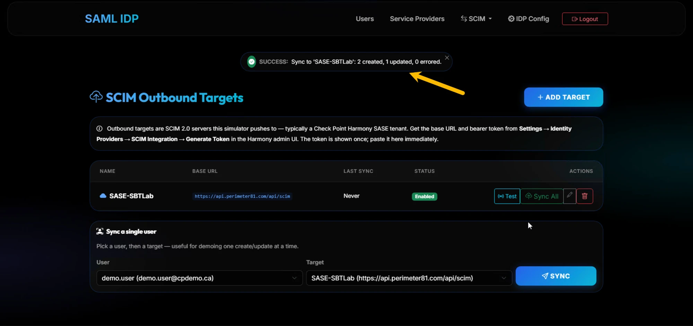

### 7.2 Inspect the push log

Click **SCIM → Push Log** in the nav. You'll see every SCIM HTTP call:

- `FIND_USER` (GET with filter)
- `CREATE_USER` (POST, 201)
- `PATCH_USER` (PATCH, 200/204)
- with full request and response bodies if you click the eye icon

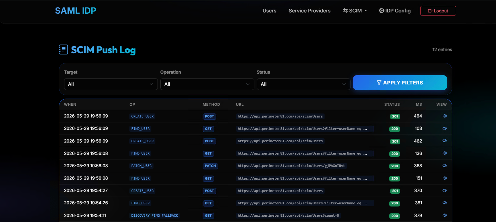

This log is gold for demos — you can show prospects the exact wire-level SCIM requests/responses.

### 7.3 Verify on Check Point SASE

In Check Point SASE → **Team → Members**. You should see your simulator's demo users (`demo.user@cpdemo.ca`, `john.smith@cpdemo.ca`, `jane.doe@cpdemo.ca`) listed with **Identity Provider: Entra ID**.

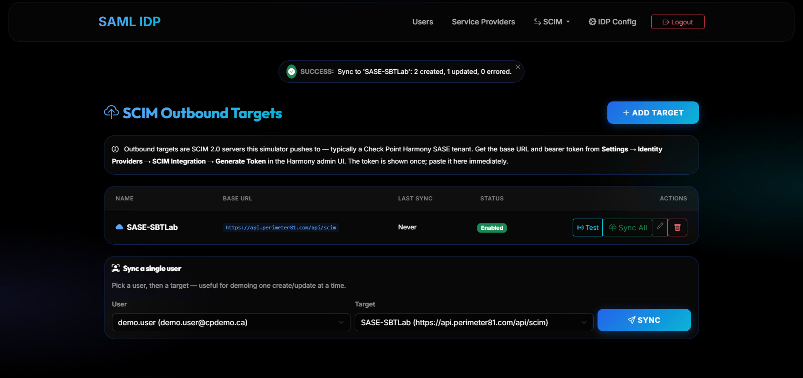

That's a complete end-to-end SCIM provisioning flow — from your simulator into a real Check Point SASE tenant.

---

## 8. Optional: auto-sync on admin changes

If you want admin user CRUD in the simulator to automatically fan out to every enabled SCIM target, set this env var in Dokploy:

```
SCIM_PUSH_ON_USER_CHANGE=true
```

Redeploy. Now whenever you add / edit / delete a user in `/admin/users/`, the simulator pushes the change to every enabled SCIM target in the background.

Failures are logged to the Push Log but never crash the admin UI.

---

## 9. Optional: receive SCIM pushes (inbound mode)

You can also point external SCIM clients (real Entra ID tenant, Okta, JumpCloud, or a `curl` script) at the simulator and have them push users *to* it.

### 9.1 Bearer token

Use the auto-generated bootstrap token from step 4.3, or generate a named one at **SCIM → Inbound Tokens → Generate**.

### 9.2 Endpoint URL

Tenant URL = `https://idp.<yourdomain>/scim/v2`

### 9.3 Test from your laptop

```bash
TOKEN=<your-token>
BASE=https://idp.<yourdomain>/scim/v2

# List current users
curl -H "Authorization: Bearer $TOKEN" $BASE/Users

# Create a user
curl -X POST -H "Authorization: Bearer $TOKEN" \
  -H "Content-Type: application/scim+json" \
  -d '{
    "schemas":["urn:ietf:params:scim:schemas:core:2.0:User"],
    "userName":"alice.test@cpdemo.ca",
    "emails":[{"value":"alice.test@cpdemo.ca","primary":true,"type":"work"}],
    "name":{"givenName":"Alice","familyName":"Test"},
    "active":true
  }' \
  $BASE/Users

# Created users appear immediately in the simulator's /admin/users page
```

---

## 10. Troubleshooting

### Test connection returns 404

Check Point SASE doesn't expose `/ServiceProviderConfig` — the simulator's Test probe automatically falls back to `GET /Users?count=0`. If both 404, the Base URL is wrong. Most common: missing `/api/scim` path or wrong region.

### Test connection returns 401

The bearer token is invalid. Go back to Check Point SASE → Identity Providers → SCIM Integration → Settings → **Generate Token** (it'll invalidate the old one and give you a new one). Paste the new token into the simulator's target (edit the target, paste in the Bearer Token field, save).

### Logs show "SCIM disabled" after setting ENABLE_SCIM=true

Your Dokploy version isn't propagating Environment-tab vars into the docker-compose substitution context. Use the marker file fallback (section 4.2).

### Sync All shows N errored

Click **SCIM → Push Log**, filter Status = error, and click the eye icon on a failed entry. You'll see the actual SCIM error response (e.g. `409 uniqueness`, `400 invalidValue` with a `detail` field explaining what Check Point SASE rejected).

Common cause: name fields containing characters outside `[a-zA-Z0-9]` — Check Point SASE rejects special chars like `@`, `,`, `#`, `$`, parentheses, hyphens etc. in `name.givenName` / `name.familyName`. Edit the offending user in the simulator and retry.

### I lost all my settings after a redeploy

This was fixed by moving the SQLite DB into the persisted `saml_idp_data` volume. If you're running an older build, redeploy `main`. Future redeploys keep all data. If you were on the old build, the first redeploy will migrate your existing DB into the volume automatically.

### `userName` shows wrong on Check Point SASE side

Check Point SASE uses email-as-userName. The simulator already sends `userName = user.email` for this reason. If you see duplicate users, it's likely because the **Match Attribute** mapping on the Check Point SASE side defaulted to `userPrincipalName` instead of `mail`. Edit the Entra ID integration in Check Point SASE and change the matching attribute to `mail`.

---

## 11. Appendix: defaults and references

### Default admin credentials

| | |
|---|---|
| Admin URL | `https://idp.<yourdomain>/admin/login` |
| Username | `admin@cpdemo.ca` |
| Password | `Cpwins!1@2026` |

Override via env vars `ADMIN_USERNAME` / `ADMIN_PASSWORD` in Dokploy.

### Default seeded users (for demos)

| Username | Email | Password |
|---|---|---|
| `demo.user` | `demo.user@cpdemo.ca` | `Cpwins!1@2026` |
| `john.smith` | `john.smith@cpdemo.ca` | `Cpwins!1@2026` |
| `jane.doe` | `jane.doe@cpdemo.ca` | `Cpwins!1@2026` |

### Default seeded SAML SPs

- Harmony Connect Portal
- Quantum Security Gateway
- SmartConsole

Edit them at `/admin/service-providers/`.

### Check Point SASE SCIM endpoints (by region)

| Region | Base URL |
|---|---|
| US | `https://api.perimeter81.com/api/scim` |
| EU | `https://api.eu.sase.checkpoint.com/api/scim` |
| AU | `https://api.au.sase.checkpoint.com/api/scim` |
| IN | `https://api.in.sase.checkpoint.com/api/scim` |

### Env vars worth knowing

| Var | Default | What it does |
|---|---|---|
| `ENABLE_SCIM` | `false` | Master switch. Setting `true` exposes `/scim/v2` + admin pages. |
| `SCIM_PUSH_ON_USER_CHANGE` | `false` | Auto-push admin user CRUD to enabled outbound targets. |
| `SCIM_ENCRYPTION_KEY` | derived from `SECRET_KEY` | Override if you want SCIM tokens to survive a `SECRET_KEY` rotation. |
| `ADMIN_USERNAME`, `ADMIN_PASSWORD` | `admin@cpdemo.ca`, `Cpwins!1@2026` | Admin login. |
| `SECRET_KEY` | hardcoded default | Flask session signing key. **Override in production.** |
| `IDP_ENTITY_ID`, `SSO_SERVICE_URL` | `https://idp.cpdemo.ca`, ... | SAML metadata values. Override with your actual domain. |

### Reference docs

- [SCIM_PLAN.md](https://github.com/alshawwaf/SAML_IDP_Simulator/blob/main/docs/SCIM_PLAN.md) — design and compliance notes
- [RFC 7643](https://datatracker.ietf.org/doc/html/rfc7643) — SCIM Core Schema
- [RFC 7644](https://datatracker.ietf.org/doc/html/rfc7644) — SCIM Protocol
- [Check Point SASE — SCIM admin guide](https://sc1.checkpoint.com/documents/Infinity_Portal/WebAdminGuides/EN/SASE-Admin-Guide/Content/Topics-SASE-IdP/SCIM/SCIM.htm)
- [Check Point SASE — Entra ID + SCIM integration](https://sc1.checkpoint.com/documents/Infinity_Portal/WebAdminGuides/EN/SASE-Admin-Guide/Content/Topics-SASE-IdP/SCIM/MicrosoftEntraID_SCIM.htm)

---

**Questions or issues?** Ping Khalid Al-Shawwaf on Teams or open an issue at the [GitHub repo](https://github.com/alshawwaf/SAML_IDP_Simulator).
